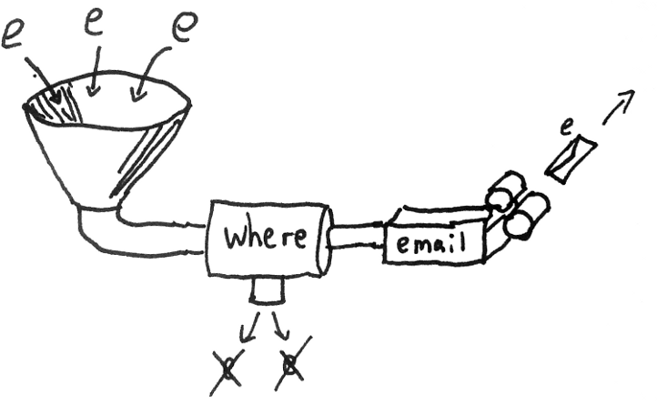

###Monitoring (security)
##with **Riemann**


Notes:


---


###**Bear**
####Operations at &yet
#####@codebear

Notes:


---


###What is **Riemann** and
###why would I ever think
###of using it for monitoring?


---


##
###Buzzword Bingo?


---


##
###Riemann is an event **stream** processor


---


###Riemann **is**
- a very low-latency
- event aggregation tool
- coupled with a powerful processing language


---


##
###A Riemann **Stream**


---


##
###Streams are **functions**
###that act on events


---


##is it **ready** to use?

Notes:
Ive heard quite a lot about it last year so I wanted to see if it could be a practical part of our toolset


---


##Yes

Notes:


---


###What can it **do**?
- Monitor change to the rate of an event
- Spot peaks
- Spot missing data
- Identify when services are overloaded

Notes:


---


###Monitor change
####For every server you monitor
####you can **find** those that are
####receiving more than the usual attention

Notes:


---


###Spot peaks
####You can trigger an alert
####when a **threshold** has been reached

Notes:


---


###Spot missing data
####Often the precursor to an **outage**
####is marked by a service hanging

Notes:


---


###Identify overloaded services
####Knowing when the total load
####of a service has exceeded
####a threshold 

Notes:


---


### **across** all hosts

Notes:


---


###Okay, let's **see** some specifics

Notes:


---


###Riemann's Config is Clojure
```
; -*- mode: clojure; -*-
; vim: filetype=clojure

(logging/init {:file "riemann.log"})

; Listen over TCP (5555), 
; UDP (5555), and websockets (5556)
(let [host "192.168.3.27"]
  (tcp-server {:host host})
  (udp-server {:host host})
  (ws-server  {:host host}))
```
Notes:
start of the config file


---


```
(periodically-expire 5 
   {:keep-keys [:host :service :tags]})

(defn log-info [event]
  (info event))
(def email
  (mailer {:from "opsbot@example.com"}))
```
Notes:
defining helper routines


---


```
(def alert-ops
   (email "opsalert@example.com")
   (fn [event] (info "alert ops" event))
)
```
Notes:


---


```
(def slack-credentials {
  :account "", :token ""})
(def chat-ops
  (slack slack-credentials {
    :username "opsbot"
    :channel "#chatops"
    :icon ":smile:"}
))
(def tell-ops (rollup 5 3600 chat-ops))
```
Notes:


---


```
(streams
  (where (state "error") tell-ops)
  (tagged "exception" tell-ops))
```
Notes:


---


```
(let [index (index)]
  (streams
    (default :ttl 60
      ; index immediately
      index
      (where (not (expired? event))
        (changed-state {:init "ok"}
          (stable 60 :state
            alert-ops
          )))
      (expired alert-ops)
    )))
```
Notes:
alert when a service stops
talk about changed-state and stable


---


###Monitor Nginx Status
####Using ```riemann-nginx-status```
####from riemann-tools, you can track
####metrics exposed by ```/nginx_status```

Notes:


---


```
{ :host web.example.com,
  :service nginx active,
  :state ok,
  :description nil,
  :metric 3,
  :tags nil,
  :time 1421514112,
  :ttl 10.0
}
```
Notes:
Event sent from riemann-nginx-status


---


```
(where service "nginx"
      (fixed-time-window 60
        (smap (fn [events] (let [fraction 
            (/ (count (filter #(= "exception" 
                                  (:state %))
                                   events))
               (count events))]
            {:service "auth failures"
             :metric  fraction
             :state   (condp < fraction 
                       0.7 "exception"
                       0.3 "warning" "ok")}))
          (changed-state alert-ops))))
```

Notes:
depends on the logstash filtering web
events and adding tags for 4XX errors
exception == 403
warning == password fails


---


###Useful links
####https://github.com/bear/MonitoringWithRiemann
####https://riemann.io/quickstart.html
####https://rrees.me/2013/04/20/getting-started-with-riemann-stream-processing/
####https://github.com/jamtur01/riemann.config
######Riemann illustrations are from riemann.io
Notes:


---
